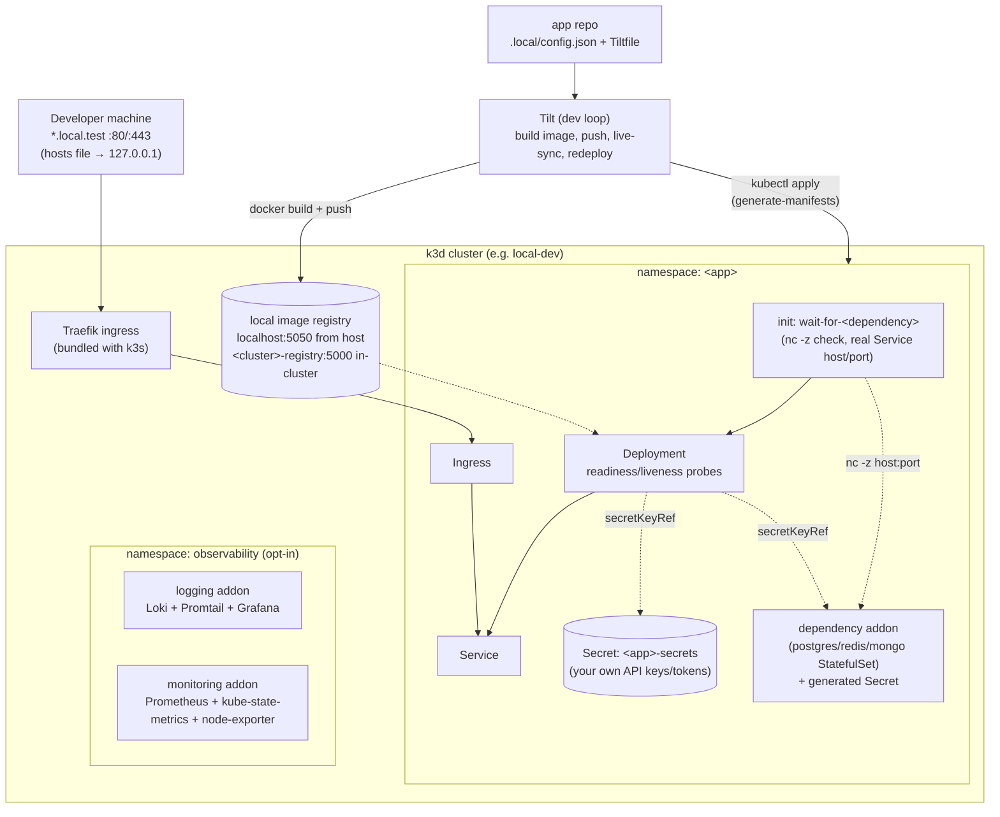
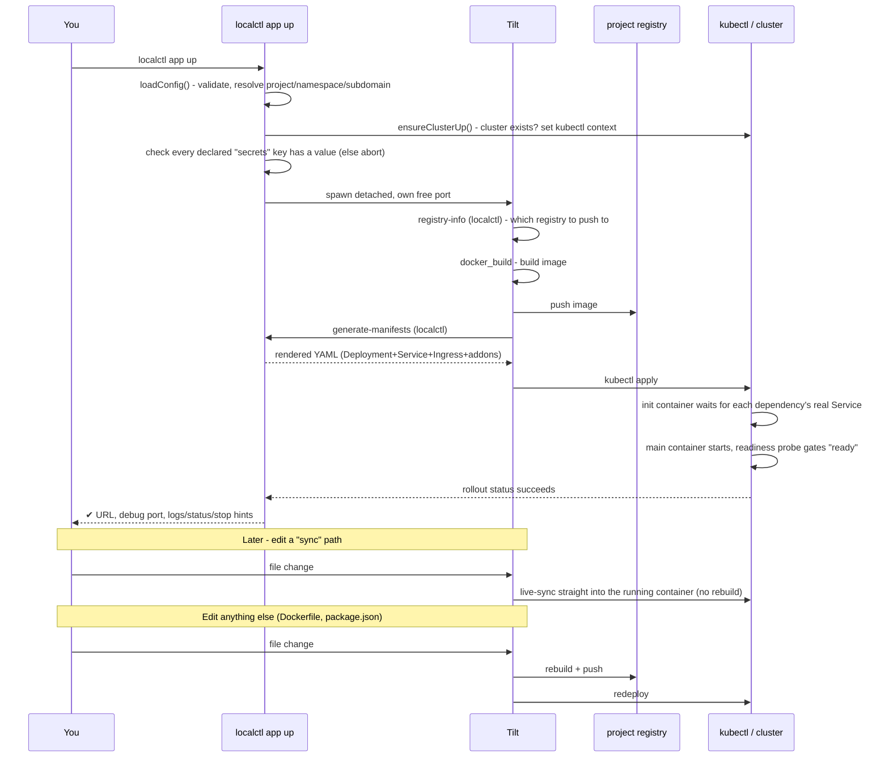
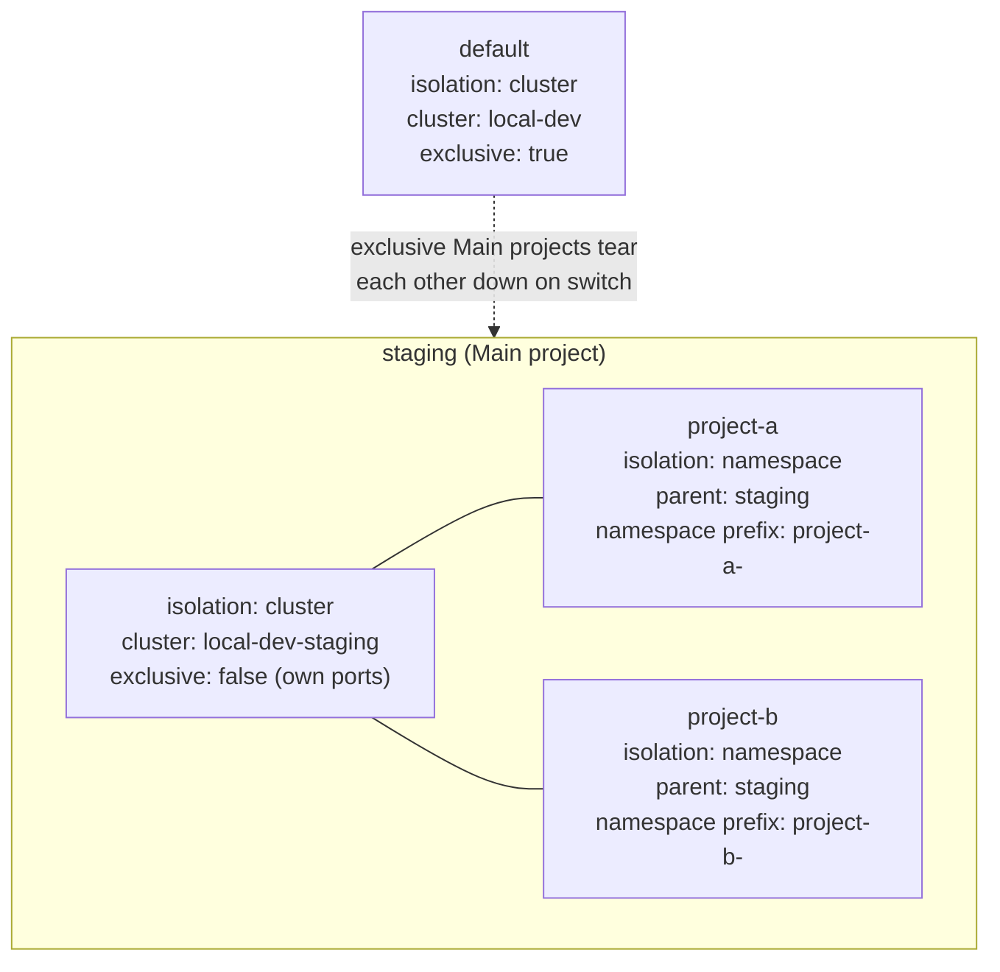

# Architecture

## Components

This shows one project's cluster (`default`, or any Main project — see [Multi-project
support](#multi-project-support) for how more than one of these coexists):



## Pieces and why they were chosen

- **k3d** (k3s-in-Docker): a full, spec-compliant Kubernetes cluster that starts in seconds,
  runs identically on macOS and Windows as long as a Docker-API-compatible engine is present,
  and ships Traefik out of the box. No VM management needed beyond what your container engine
  already does.
- **Local registry**: a plain `registry:2` container (one per project - `local-dev-registry` for
  `default`, `local-dev-<name>-registry` for any other Main project, `clusterProvision.js`) on that
  project's own Docker/Podman network, rather than k3d's built-in `registries.create`. That
  built-in feature hard-codes attaching to a network literally named `bridge` — which Docker has by
  default but Podman does not — and breaks cluster creation under Podman. A plain container
  sidesteps that and behaves identically on every engine. `localctl app registry-info` (called from
  the Tiltfile) is what tells Tilt which project's registry to push to.
- **Traefik** (bundled with k3s): handles host-based routing so every app gets its own
  `<subdomain>.local.test` without you writing ingress controller config by hand.
- **mkcert**: generates a locally-trusted wildcard certificate for `*.local.test`, installed once
  as the cluster's default TLS certificate (via a Traefik `TLSStore`). Every app's ingress gets
  HTTPS for free by just setting `"tls": true` in its config.
- **Tilt**: the dev inner loop. It builds your image and pushes it to `localhost:5050` (the local
  registry, from your machine's point of view — port 5050, not 5000, because macOS's Control
  Center/AirPlay Receiver squats on 5000 by default), while the generated manifests reference
  `local-dev-registry:5000` (the same registry, from the cluster's point of view) — Tilt's
  `default_registry(..., host_from_cluster=...)` handles that push/pull address split. It also
  applies the generated manifests and — the important part — live-syncs changed files straight
  into the running container for the paths you list under `"sync"`, skipping a full
  rebuild/redeploy for fast iteration. It also owns port-forwarding, including debug ports.
- **localctl** (Node.js CLI, this repo's `cli/`): the single source of truth for both turning
  `.local/config.json` into Kubernetes manifests, and for infra lifecycle itself. The Tiltfile in
  every app repo is a thin, generic wrapper that just calls `localctl app generate-manifests` — all the
  actual logic (validation, templating, addon composition) lives here, so you never hand-edit
  Kubernetes YAML in an app repo. `localctl setup` and `localctl uninstall` similarly hold all
  the real setup/teardown logic; `bin/bootstrap.sh`/`bootstrap.ps1` only do the one thing that has
  to happen before the CLI exists (install Node, `npm install`, put a shim on your PATH) and then
  hand off — see [Getting Started](./getting-started.md).
- **Hosts file automation**: `<subdomain>.local.test` resolves via entries `localctl` manages
  in `/etc/hosts` (macOS) or the Windows hosts file, inside a clearly marked block. No extra DNS
  daemon to keep running in the background.
- **Background dev loop**: `localctl app up` runs Tilt fully detached by default (own process group,
  `PPID=1`) so it survives closing the terminal — `-f`/`--foreground` opts back into the old
  blocking, interactive Tilt UI. The detached PID, its assigned Tilt port, and its log file live in
  `~/.localctl/run/<app>.{pid,port,log}`; `localctl app status` reads the PID file to report whether an
  app's dev loop is actually still alive, and `localctl app down` stops that process (if running)
  before tearing down the app's Kubernetes resources, so a background Tilt process can't fight the
  teardown. `localctl app up` also assigns each Tilt instance a random free port for its own web UI
  (`tilt up --port <n>`, `cli/src/lib/exec.js#getFreePort`) instead of Tilt's shared default —
  without this, running two apps at once (the entire point of detached mode) collides outright on
  Tilt's fixed default port, with an error that gives no hint why. You're not meant to need that
  port directly; `localctl app status`/`logs` are the supported way to check on an app. The one place
  it's used explicitly is `localctl app reload`, which reads it to run `tilt trigger --port <n> <app>`
  — Tilt already auto-reloads on file changes (including `.local/config.json`, tracked via
  `read_json`), so `reload` exists for the separate case of wanting to force a rebuild/redeploy
  right now, with no change involved.

## Dev inner loop: `localctl app up` to a running pod



## Request routing: browser to pod

```mermaid
sequenceDiagram
    participant Browser
    participant Hosts as hosts file
    participant Traefik
    participant Svc as Service
    participant Pod

    Browser->>Hosts: resolve &lt;subdomain&gt;.local.test
    Hosts-->>Browser: 127.0.0.1 (localctl hosts sync wrote this)
    Browser->>Traefik: HTTPS request, SNI = &lt;subdomain&gt;.local.test, :443
    Traefik->>Traefik: match Ingress by Host header
    Traefik->>Traefik: no per-app TLS secret set -> fall back to<br/>default TLSStore cert (*.local.test, from mkcert)
    Traefik->>Svc: forward to matching Service:port
    Svc->>Pod: forward to a Ready pod (readinessProbe gates this)
    Pod-->>Browser: response
```

Two things worth calling out since they're easy to misdiagnose: the wildcard cert is one level deep
(`*.local.test` matches `app.local.test`, not `app.project.local.test`) — which is exactly why a
namespace-scoped project's subdomain is `<scope>-<app>.local.test` (one label, prefixed) rather than
a nested subdomain; and Traefik only routes to a pod once its readiness probe passes, so a
newly-deployed app can 502 for a few seconds even after `kubectl apply` succeeds — normal, not a bug.

## `~/.localctl` layout

All of `localctl`'s local state lives under `~/.localctl` (`%USERPROFILE%\.localctl` on Windows):

```
~/.localctl/
├── bin/            localctl shim + PATH entry (bin/bootstrap.sh installs only, not npm installs)
├── certs/          the *.local.test TLS cert + key generated by mkcert (shared by every cluster)
├── apps.json       registered app subdomains, used by `localctl hosts sync`
├── profiles.json   every project this machine knows about, and which one is active - see
│                   "Multi-project support" below
└── run/            <app>.pid + <app>.log per background dev loop started by `localctl app up`
```

`localctl uninstall` stops any background dev loop it finds still running (reading `run/*.pid`)
and removes `certs/`, `apps.json`, `profiles.json`, and `run/`; `bin/uninstall.sh`/`uninstall.ps1`
remove the whole directory, including `bin/`, once the CLI process itself has exited (see
[Uninstalling](./uninstalling.md) for why that split exists).

## Podman-specific handling

Podman is a first-class target, not an afterthought bolted on later — two things needed explicit
handling because Podman's Docker-API compatibility isn't perfect:

- **Build protocol**: Tilt's `docker_build` defaults to BuildKit's gRPC build protocol, which
  Podman's compat socket doesn't implement. `localctl app up` detects Podman at runtime and sets
  `DOCKER_BUILDKIT=0` for that `tilt up` invocation automatically (`cli/src/lib/engine.js`).
- **Insecure registry trust**: Podman's daemon runs inside a VM on macOS/Windows, and that VM's
  own `registries.conf` — not anything on the host — decides whether it'll talk plain HTTP to our
  local registry. `localctl setup` writes that config into the VM via `podman machine ssh` and
  restarts the VM once, before creating the cluster, so nothing else has to be torn down and
  restarted after (`cli/src/lib/podman.js`; `localctl uninstall` reverses it the same way).

See [Troubleshooting](./troubleshooting.md) if either of these needs to be re-diagnosed.

## Per-app vs. cluster-wide, and how addons actually work

- **Per-app dependencies** (`postgres`, `redis`, `mongo` in `.local/config.json`) are deployed
  into the app's own namespace, one instance per app. Simple, isolated, disposable with
  `localctl app down`.
- **Cluster-wide addons** (currently: `logging`, `monitoring`) are shared infrastructure you turn
  on once via `localctl addons enable <name>`, living in the `observability` namespace, useful
  across every app.

Both are backed by the same mechanism: each addon is a folder with one `addon.yaml` pointing at a
real, published Helm chart (Bitnami's PostgreSQL/Redis/MongoDB charts; Grafana Labs' own
loki-stack chart for logging) — not hand-rolled JS manifests. A generic loader
(`cli/src/lib/addonLoader.js`) adds the chart's repo, generates any secrets the addon declares as
real Kubernetes Secrets (never plaintext, injected into the app via `secretKeyRef`), turns an
optional `config/` folder into a ConfigMap for content that isn't a Helm value (e.g. a Grafana
dashboard JSON), and runs `helm template` to produce the manifests — merged into the app's own
deploy for per-app dependencies, or applied directly for cluster-wide addons. Dependency types
(`configSchema.js`'s validation) and cluster addon names (`localctl addons list`) are both
discovered by scanning for `addon.yaml` files, not hardcoded — dropping in a new folder is the
entire integration step.

Addons are searched in two places (`cli/src/lib/addonDirs.js`): `~/.localctl/addons` (or
`$LOCALCTL_ADDONS_DIR`) first, then the ones bundled with the CLI — a name in your own directory
overrides a built-in one of the same name. This is deliberate: installing this tool shouldn't mean
inheriting its author's addon set, and adding your own shouldn't mean forking the tool. Full
reference and how to add a new one: [Adding Tools](./adding-tools.md).

**Dependency ordering**: `generateManifests()` gives the app's Deployment one `wait-for-<type>`
init container per entry in `dependencies`, blocking the main container from starting until that
dependency's real Service is actually accepting connections (`nc -z` in a small busybox
container). The host/port it waits on comes from `addonLoader.js`'s own `connect` field - read back
from the chart's actual rendered `Service` object, not guessed from an env var name (`POSTGRES_PORT`
is only as reliable as that one addon's own `addon.yaml`; the rendered Service's `spec.ports[0]` is
always right, for any addon). This needs nothing from a custom addon author - any `addon.yaml` that
renders a Service gets it for free.

**Readiness/liveness**: every app gets a `readinessProbe`/`livenessProbe` on its main container
(`buildProbe()` in `manifestGen.js`) - a plain TCP check on `port` unless `probes.readiness`/
`.liveness` in `.local/config.json` sets a `path` (switches that one to an HTTP GET). Without this,
`kubectl rollout status` succeeding only ever meant "the process started," never "it's actually
serving" - see [Config Schema](./config-schema.md#probes).

**App-level secrets** (`localctl app secrets set/unset/list/show`, `cli/src/lib/appSecrets.js`)
follow the same never-plaintext principle as addon-generated credentials, but for values *you*
supply (an API key) rather than ones generated for you (a DB password): `.local/config.json`'s
`secrets` array holds names only, `app secrets set` stores the actual value once as a real k8s
Secret (`<app>-secrets`), and `generateManifests()` wires each declared name to it via
`secretKeyRef` - the value never touches `.local/config.json`, a Helm value, or a plaintext env var.
`localctl app up` checks every declared key actually has a value before deploying, rather than
letting the pod fail to start with a raw `CreateContainerConfigError`.

**How `localctl addons status` finds addon instances**: every addon's rendered manifest gets one
extra object appended to it — a small ConfigMap labeled `localctl.dev/addon: "true"`, recording
which addon it is, its chart+version, and which app owns it (blank for cluster-wide). Its lifecycle
is tied to the addon's own resources (created and deleted together, via the same `kubectl apply`/
`delete` calls, no separate tracking code), so it can't drift out of sync with what's actually
there. This exists because real Helm charts use whatever workload kind fits them — Bitnami's
Postgres and Redis charts both use a StatefulSet, not the Deployment a hand-rolled addon would have
used — so guessing "which kind of resource is this addon" from a naming convention is exactly the
kind of fragility `cli/src/lib/workloadReadiness.js` was written to route around once already
(shared by both `localctl app status`'s dependency listing and `localctl addons status`).

## Command structure

`localctl` groups commands by what they operate on, not a flat list: **global** (not tied to any
one app, addon, or project) commands — `setup`, `uninstall`, `doctor`, `hosts` — sit at the top
level; everything scoped to a single app lives under `localctl app <subcommand>` (`new`, `up`,
`down`, `status`, `logs`, `reload`, `exec`, `prune`, the internal `generate-manifests`/
`registry-info`, plus its own `secrets` subgroup - `set`/`unset`/`list`/`show`); everything scoped
to addons lives under `localctl addons <subcommand>` (`list`, `enable`, `disable`, `status`);
everything scoped to projects lives under `localctl profiles <subcommand>` (`new`, `list`,
`switch`, `status` - see "Multi-project support" below). A command's home tells you its scope
before you even run `--help`.

## Multi-project support

Beyond the single `default` project (today's one always-there cluster, unchanged), `localctl`
supports any number of additional **projects**, each one either:

- a **Main project** (`isolation: "cluster"`) - its own real, separate k3d cluster, registry
  container, and kubectl context. Created with `localctl profiles new` (choosing "cluster"), or
  it's `default` itself.
- a **namespace-scoped project** (`isolation: "namespace"`) - nested under exactly one Main
  project via `parent`, sharing that Main project's cluster/registry/TLS cert entirely. Isolated
  only by a namespace + subdomain prefix (an app's `orders-api` becomes namespace
  `project-a-orders-api`, reachable at `project-a-orders-api.local.test` - see
  `namespaceScopeFor()`/`loadConfig.js`). This is how "one cluster, several projects" (Main
  project → Project A, Project B → their own apps/addons) is expressed.



`default` and `staging` are both Main projects (each a real, separate cluster); `project-a`/
`project-b` are namespace-scoped, nested under `staging`'s single cluster. Switching between
`project-a`/`project-b` is free (same cluster); switching to/from `default` tears one cluster down
and brings the other up, unless `staging` was created with `exclusive: false`.

**Which project governs a directory** is resolved by walking up from it looking for the nearest
`.local/project.json` (`{"profile": "<name>"}`) - the same lookup shape as git finding `.git`, or
Claude finding `.claude` (`cli/src/lib/projectContext.js`). This is independent of, and layered on
top of, each app's own `.local/config.json` (still just the app's own directory, unchanged) - so
either layout works: one `project.json` at a parent folder above several per-app subfolders each
with their own `config.json`, or a single `.local` folder holding both together. No `project.json`
anywhere above a directory means its apps belong to `default`. Every registered project's actual
definition (isolation, parent, exclusive, ports) lives centrally in `~/.localctl/profiles.json`,
not duplicated in the repo - `project.json` is just a pointer, so `localctl profiles new <name>`
needs running once per machine even if `project.json` is checked into a shared repo.

**Two clusters can't both bind host `:80`/`:443`** - a real OS constraint, not just a design
choice. This is what the per-Main-project `exclusive` setting is for:

- `exclusive: true` (the default, including for `default` itself) - the project reuses the
  standard `:80`/`:443`/registry `:5050` ports and plain `https://<subdomain>.local.test` URLs,
  at the cost of only one such project's cluster being able to run at a time. `localctl profiles
  switch`/`new` tear down every other `exclusive` Main project's cluster first when bringing this
  one up.
- `exclusive: false` - the project gets its own free ports instead (assigned once at creation,
  stored in its `profiles.json` entry), so its cluster can run alongside others - at the cost of
  URLs needing a `:<port>` suffix.

Switching between two namespace-scoped projects nested under the *same* Main project is always
cheap - no cluster teardown, just flipping which project's namespace/subdomain prefix ad-hoc
commands (`doctor`, `hosts`, `addons`) target next (directory-scoped `app` commands never needed
this in the first place - they resolve their own project from `project.json`, regardless of which
one is "active").

Every app-scoped and cluster-wide command checks its target project's cluster is actually up
before doing anything else, rather than failing with a raw `kubectl`/Tilt error further down - see
[Troubleshooting](./troubleshooting.md#no-cluster-running-for-project-name) for the exact messages
and fixes. Tilt itself learns the right registry per app via the internal `localctl app
registry-info` command (`Tiltfile.tmpl` shells out to it instead of hardcoding
`localhost:5050`/`local-dev-registry:5000`), since a project on its own cluster has its own
registry.

**Which commands resolve which project** - worth knowing exactly, since it's the one thing that
actually differs between them:

| Command | Resolution |
|---|---|
| `app new`, `up`, `down`, `status` (no `-a`), `exec`, `prune`, `secrets ...` | **Directory** - walks up for `.local/project.json`, same as `loadConfig()`. Works from anywhere under the project's folder tree. |
| `app logs` (no name), `app logs <name>` | Directory if run bare inside an app repo; an explicit `<name>` from elsewhere falls back to the **active** project instead (best-effort - see below). |
| `app status -a <name>`, `app status -A` | **Active** project's cluster - there's no directory to resolve a name-only lookup from. |
| `app reload` | Neither - keys off the tracked pid/port file by app name only; the already-running Tilt process already knows its own project. |
| `doctor`, `hosts ...`, `addons ...` | **Active** project (`localctl profiles switch` sets this). Not tied to any one app's directory. |
| `setup` | Always `default`, unconditionally - not project-aware, doesn't read the active pointer. |
| `profiles switch/new` | Explicit `<name>` argument - this is how "active" changes in the first place. |
| `profiles list`, `status` | Reads the whole registry / the active pointer - no target to resolve. |

The directory-resolved commands are what let "cd in and run a command" work without ever needing to
think about which project you're in; the active-project ones are for everything that has no
directory of its own to resolve from.

## Sidecars

`.local/config.json`'s `"sidecars"` array adds extra containers to your app's own pod (see
[Config Schema](./config-schema.md#sidecars) for the field reference) — `buildDeployment()` in
`cli/src/lib/manifestGen.js` just appends them to the same pod spec as the main app container.
Because they share the pod's network namespace, your app reaches a sidecar via `localhost:<port>`
with no Service needed — nothing addon-specific here, it's the same mechanism Kubernetes itself
uses for the pattern.

## Repo layout

```
Project-Infra/
├── bin/                  thin installer stubs (macOS + Windows) - install Node/CLI, then hand off
│                         to `localctl setup`/`localctl uninstall`
├── cluster/              cluster-level manifests (TLS store, addon namespace) - the k3d cluster
│                         config itself is generated per-project at runtime, not a file here
│                         (`cli/src/lib/clusterProvision.js`)
├── cli/                  the localctl Node.js CLI
│   ├── src/commands/     one file per CLI subcommand
│   ├── src/lib/          config validation, manifest generation, hosts file logic
│   │   ├── addonLoader.js       generic Helm addon loader
│   │   ├── addonDirs.js         resolves ~/.localctl/addons vs. built-in, with precedence
│   │   ├── appSecrets.js        per-app Secret CRUD - `localctl app secrets ...`
│   │   ├── clusterAddons.js     cluster-wide addon render/enable/disable, shared by `addons` and
│   │   │                        `profiles new`'s carry-over wizard
│   │   ├── clusterProvision.js  bring-up/teardown for one project's cluster+registry+TLS
│   │   ├── profileStore.js      ~/.localctl/profiles.json - every project, and which is active
│   │   ├── projectContext.js    walks up from a directory for the nearest .local/project.json
│   │   └── addons/       built-in: per-app (postgres/redis/mongo/) + cluster/ (logging/, monitoring/)
│   └── templates/        generic Tiltfile copied into app repos by `localctl app new`
~/.localctl/addons/       your own addons (create yourself) - see docs/adding-tools.md
├── schema/               JSON Schema for .local/config.json (editor autocomplete)
├── examples/             sample app configs
└── docs/                 you are here
```
