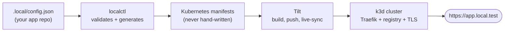

## Why localctl

Running several apps on Kubernetes locally usually means port juggling, hand-written YAML,
self-signed certificate warnings and slow rebuilds. `localctl` replaces all of that with one JSON
file per app.

<div class="grid cards" markdown>

-   :material-kubernetes:{ .lg .middle } __One cluster, one CLI__

    ---

    A single [k3d](https://k3d.io) cluster runs every app you develop. No per-project Kubernetes
    setup, no VM sprawl.

-   :material-web:{ .lg .middle } __A subdomain per app__

    ---

    `orders.local.test`, `billing.local.test`, routed by Traefik. No more `localhost:3000` vs
    `localhost:3001`.

-   :material-lock-check:{ .lg .middle } __HTTPS by default__

    ---

    A locally-trusted wildcard certificate from `mkcert`, wired into the ingress for you. Green
    padlock, no browser warnings.

-   :material-file-code:{ .lg .middle } __Config, not YAML__

    ---

    Each app has one `.local/config.json`. Every Kubernetes manifest is generated from it.

-   :material-sync:{ .lg .middle } __Fast inner loop__

    ---

    [Tilt](https://tilt.dev) builds, deploys and live-syncs changed files into the running
    container. No full rebuild for every edit.

-   :material-bug-check:{ .lg .middle } __Debugger-friendly__

    ---

    Debug ports forwarded to `localhost`. Node, Python, Go, Java and .NET
    [patterns](debugging.md) ready to copy.

-   :material-database:{ .lg .middle } __Databases in one line__

    ---

    Postgres, Redis and MongoDB per app from real Helm charts, with credentials injected as
    Secrets and a `wait-for-<type>` init container.

-   :material-key-variant:{ .lg .middle } __Secrets, never plaintext__

    ---

    `localctl app secrets set` stores API keys as Kubernetes Secrets. `config.json` only ever
    holds the key name.

-   :material-source-branch:{ .lg .middle } __Multi-project when you need it__

    ---

    `localctl profiles new` creates an isolated project: its own cluster, or a namespace in an
    existing one, picked up by directory.

</div>

## How it works



`localctl` validates the config, generates every manifest and manages the cluster lifecycle. Tilt
handles the build, push and live-sync loop. Full breakdown in [Architecture](architecture.md).

## Up and running in four steps

<div class="lc-steps" markdown>

1.  **Install the CLI** (Node.js 18+):

    ```sh
    npm install -g @localctl/cli
    ```

2.  **Set up your machine** once. Installs `k3d`, `kubectl`, `tilt`, `mkcert` and `helm` if missing,
    creates the cluster and trusts the `*.local.test` certificate:

    ```sh
    localctl setup
    ```

3.  **Scaffold your app** from inside its repository:

    ```sh
    localctl app new
    ```

4.  **Deploy it** with live reload:

    ```sh
    localctl app up
    ```

</div>

!!! info "Requirements"
    **macOS** or **Windows**, a running container engine ([Podman Desktop](https://podman-desktop.io/)
    tested; Docker Desktop and Rancher Desktop experimental), and **Homebrew** or **winget** for
    the one-time tool install.

[Full walkthrough :material-arrow-right:](getting-started.md){ .md-button .md-button--primary }

## Where to go next

<div class="grid cards" markdown>

-   :material-rocket-launch:{ .lg .middle } __[Getting started](getting-started.md)__

    ---

    Install, deploy your first app, and set up more than one project.

-   :material-console:{ .lg .middle } __[CLI commands](cli-reference.md)__

    ---

    Every `localctl` command and what it does.

-   :material-code-json:{ .lg .middle } __[Config schema](config-schema.md)__

    ---

    Every `.local/config.json` field: secrets, probes, sidecars, dependencies.

-   :material-sitemap:{ .lg .middle } __[Architecture](architecture.md)__

    ---

    Every component, why it was chosen, and how they fit together.

-   :material-puzzle:{ .lg .middle } __[Adding tools](adding-tools.md)__

    ---

    Add a database or a cluster-wide addon with one `addon.yaml` file.

-   :material-wrench:{ .lg .middle } __[Troubleshooting](troubleshooting.md)__

    ---

    Known issues, with the root cause and the fix for each.

</div>
