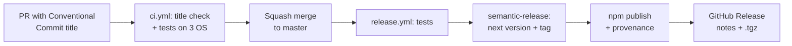

# Releasing

`localctl` ships to npm as [`@localctl/cli`](https://www.npmjs.com/package/@localctl/cli), built
from the `cli/` directory. Releases are fully automatic: **merging a PR to `master` is the
release.** [semantic-release](https://semantic-release.gitbook.io/) reads the commit messages,
picks the version, publishes to npm and creates the GitHub Release. Nobody runs `npm publish` or
bumps a version by hand.



## Commit messages decide the version

PRs are **squash-merged**, so the PR title becomes the single commit on `master`. CI rejects PR
titles that aren't [Conventional Commits](https://www.conventionalcommits.org/).

| PR title | Release |
|---|---|
| `fix: hosts entry not removed on uninstall` | patch `0.2.0` → `0.2.1` |
| `feat: add mysql addon` | minor `0.2.1` → `0.3.0` |
| `feat!: rename app up to app start` (or `BREAKING CHANGE:` in the body) | major `0.3.0` → `1.0.0` |
| `perf: ...` | patch |
| `docs:`, `chore:`, `ci:`, `refactor:`, `test:`, `build:`, `style:` | no release |

A scope is optional: `feat(addons): add mysql`.

## Where the version lives

In **git tags only** (`vX.Y.Z`). `cli/package.json` in the repo stays at `0.0.0-development`.
semantic-release writes the real version into it inside CI, just before packing. No release
commits are pushed back to `master`, so branch protection doesn't get in the way and the history
stays clean.

Release notes live in [GitHub Releases](https://github.com/psilvmoreira/localctl/releases),
generated from the commit messages.

## Pre-releases

Push or merge to a `beta` branch. Versions look like `0.3.0-beta.1` and are published to the
`beta` dist-tag, so `npm install -g @localctl/cli` never picks them up. Install them with
`npm install -g @localctl/cli@beta`. Merging `beta` into `master` releases the stable version.

## What CI checks

Every PR runs:

- **pr-title** (`pr-title.yml`) - the title is a valid Conventional Commit. Re-runs when you
  edit the title.
- **test** (`ci.yml`) on Linux/macOS/Windows × Node 18/22:
    - `npm test` - every command module loads, `--version` matches `package.json`.
    - `npm run test:pack` - builds the real tarball, installs it into a throwaway prefix, runs the
      installed binary. Catches files missing from the package before users do.

`release.yml` re-runs the tests on `master` before releasing.

## Something went wrong

**npm versions are immutable.** A published number can never be reused. Don't unpublish; fix
forward:

```
npm deprecate @localctl/cli@X.Y.Z "Broken: <reason>. Use X.Y.Z+1."
```

Then merge a `fix:` PR, which releases `X.Y.Z+1`. If the fix will take a while, point `latest`
back at the last good version: `npm dist-tag add @localctl/cli@<good-version> latest`.

**The release job failed after creating the tag but before publishing:** fix the cause, delete
the tag (`git push origin :refs/tags/vX.Y.Z`), and re-run the failed workflow.

## What goes in the package

`cli/package.json` `files` is an allowlist: `bin/`, `src/`, `templates/`, plus build output that
`prepack` (`cli/scripts/sync-assets.js`) copies in from the repo root:

| Repo root (source of truth) | In the package |
|---|---|
| `cluster/manifests/` | `assets/manifests/` |
| `schema/` | `schema/` |
| `README.md`, `LICENSE` | same |

The copies are git-ignored. Edit the repo-root files only. In a git checkout, `localctl` reads
`cluster/manifests/` directly. If you ran `npm pack` locally, delete `cli/assets/` so stale copies
don't shadow your edits.

Inspect the exact contents any time: `cd cli && npm pack --dry-run`.

## One-time setup

1. **npm**: create an account with 2FA, and an organization named `localctl` (free plan).
2. **Baseline tag**: without a tag, semantic-release starts at `1.0.0`. To stay on `0.x`:
   `git tag v0.1.0 <commit> && git push origin v0.1.0`.
3. **First publish uses a token**: npm trusted publishing can only be configured on a package that
   already exists. Create a granular access token (read/write on `@localctl`, short expiry, bypass
   2FA) and add it as the `NPM_TOKEN` Actions secret.
4. **GitHub**:
    - Settings > General > Pull Requests: allow **squash merging** only, with the default commit
      message set to **Pull request title**.
    - Settings > Environments: create `npm`, limited to the `master` and `beta` branches.
5. **Switch to trusted publishing** after the first release: on npmjs.com, open the package and go
   to Settings > Trusted Publisher > GitHub Actions. Use repository `psilvmoreira/localctl`,
   workflow `release.yml` and environment `npm`. Then delete the `NPM_TOKEN` secret, revoke the
   token, and set Publishing access to *Require two-factor authentication and disallow tokens*.
